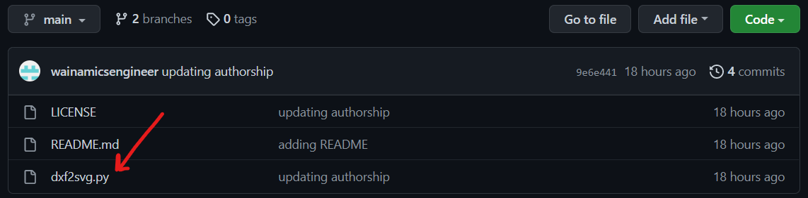
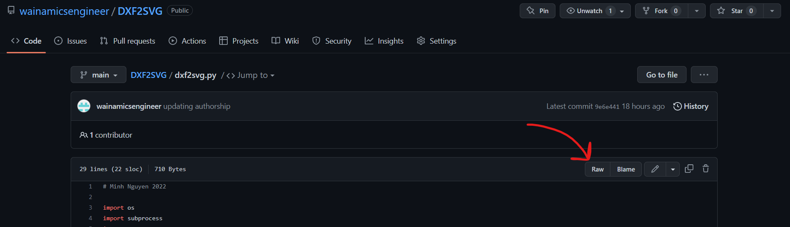
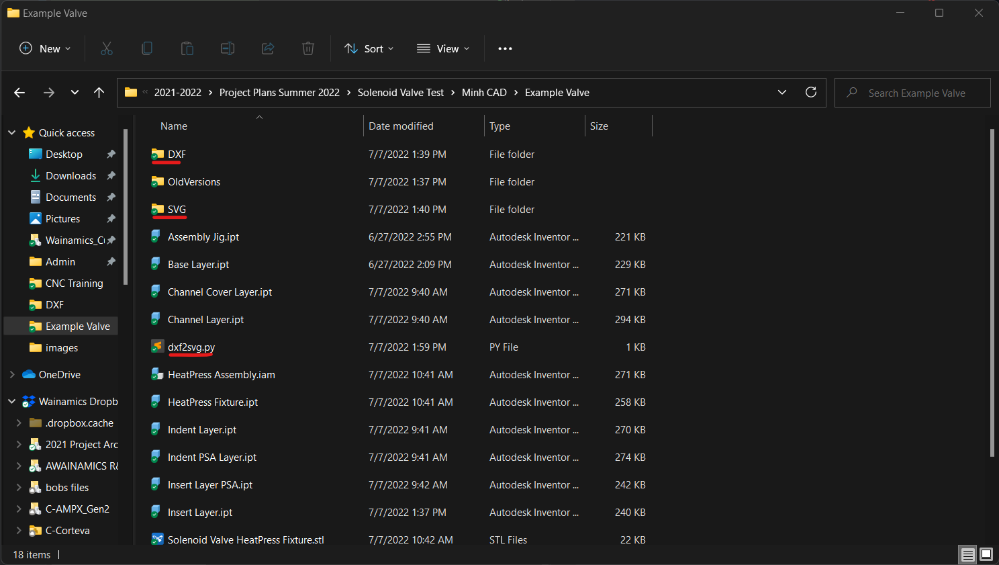
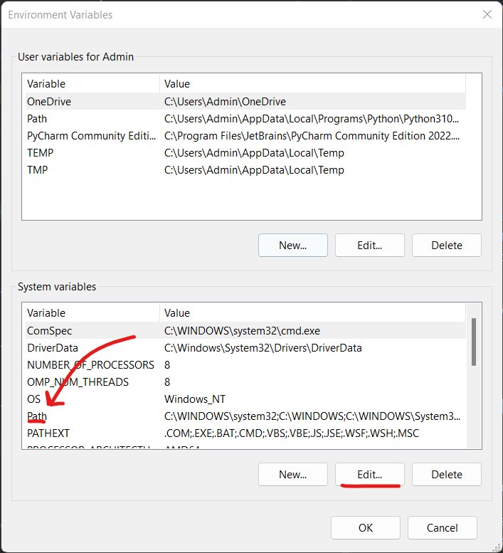
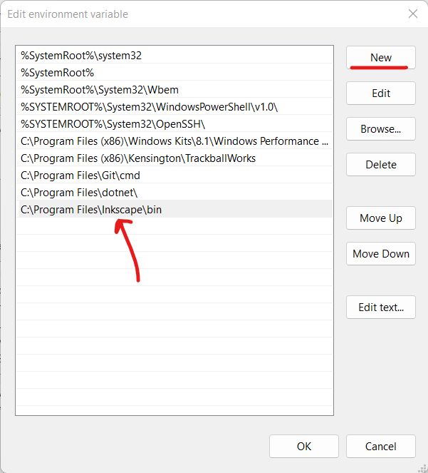

# Installation 
1. Python
3. Inkscape  

are needed to run this script.

The easiest way to install python on a Windows computer is to open Powershell and type:
```commandline
python3
```
This should open the windows store to the Python3.10 app which you should install by pressing *Get* in the Windows store.    
https://apps.microsoft.com/store/detail/python-310/9PJPW5LDXLZ5?hl=en-us&gl=US is the direct link to it.  

Next, type 
```commandline
python3.10 -m pip install keyboard
```
which installs a necessary dependency for the script to run. It might take a while but if it doesn't error it's installing in the background.

Inkscape can be downloaded from here: https://inkscape.org/release/inkscape-1.2/.

Inkscape needs to be in your system path for the script to work. If you're not sure if it is, continue with the rest of the instructions and if it gives an Inkscape error go to the ***Troubleshooting*** section at the bottom.

# Usage  
First, create a folder with all your DXF files (DXF-FOLDER) and an output folder for your SVG files (SVG-FOLDER).


Then save the script into the parent directory of both those folders. You can save the script from Github by clicking the file, click the raw option in the upper right corner of the code.



Press Ctrl+S to save the file into the parent directory of both the DXF-FOLDER and SVG-FOLDER.
An example setup is here where the script is saved to a folder a level above both the DXF folder and SVG folder.


Right click and open a terminal in the same parent folder and run:
```commandline
python3.10 dxf2svg.py DXF-FOLDER SVG-FOLDER
```
replacing the folder names with whatever it is in your system.

More generally:
```commandline
python dxf2svg.py indir outdir
```

# Design  
The script uses the Inkscape CLI to export a DXF as an SVG. The Inkscape CLI does an annoying thing where it opens a dialog window to confirm scaling.
To avoid this, the script presses enter 5 seconds after opening the DXF file in Inkscape to skip the dialogue which could be problematic if Inkscape takes longer than 5 seconds to open a DXF file.

Ideally, Python would wait for the dialog to load in, then press enter but that would require way more code.

# Troubleshooting
If during the execution of the script, inkscape is not found that means that your system doesn't have Inkscape in its PATH.
To fix this:
1. Type **System Path** in the windows start menu which will go into settings
2. Click **Environment Variables** at the bottom right of the dialog.
3. Click on Path and **Edit** 
4. Click **New** and add ```C:\Program Files\Inkscape\bin``` to the newline created. 
5. Restart your computer for the change to propagate and rerun the script which should now work.


It could be the case that Python presses enter on a window which is not the dialog. In that case, you would manually click OK on the inkscape dialogue and the script will continue as normal.
To avoid this, refrain from clicking around or typing while the script is running, which is an unfortunate design flaw of it.